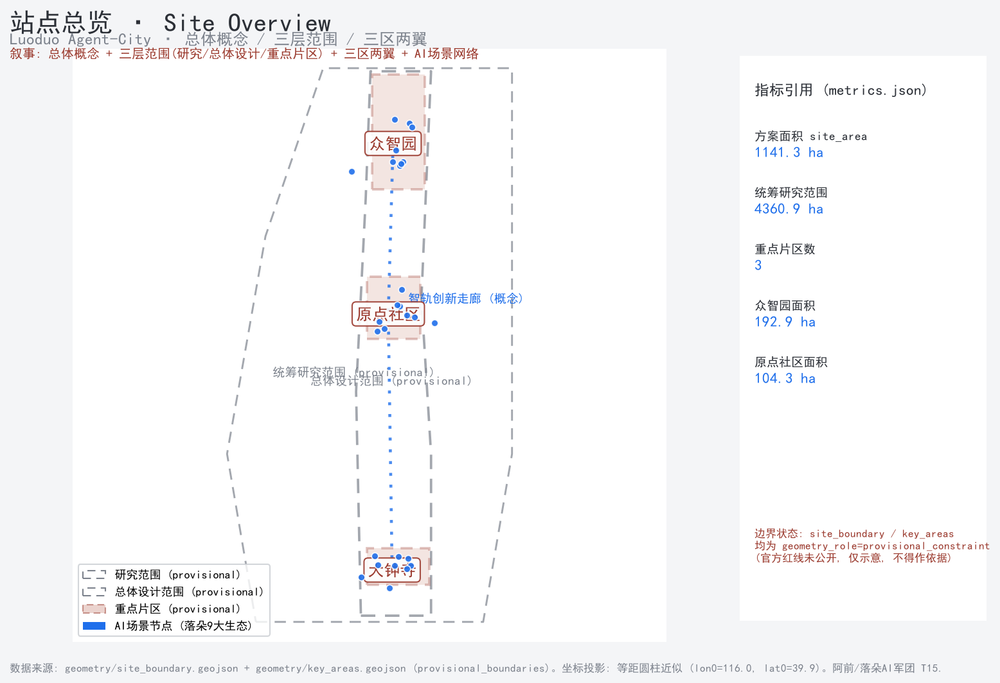
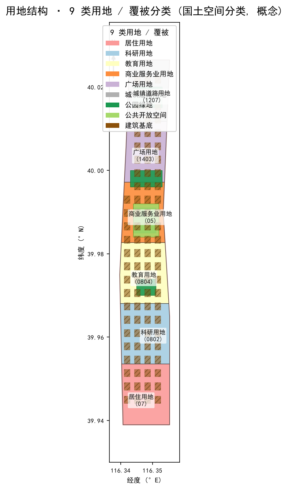
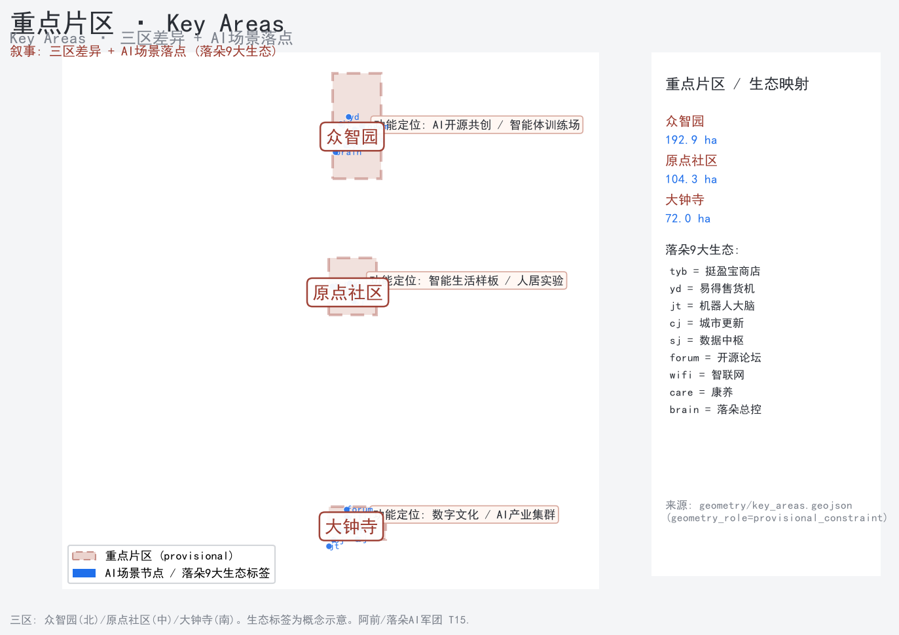
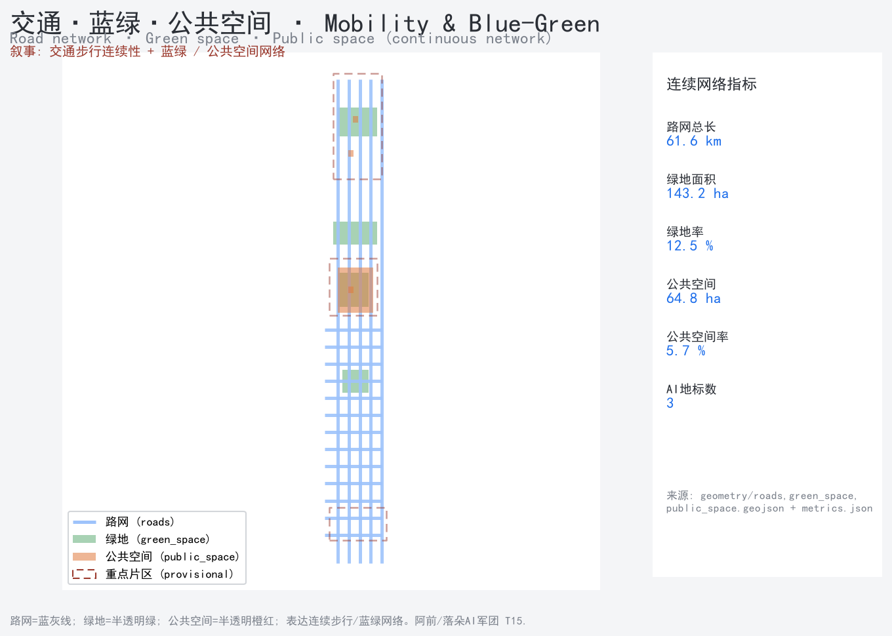
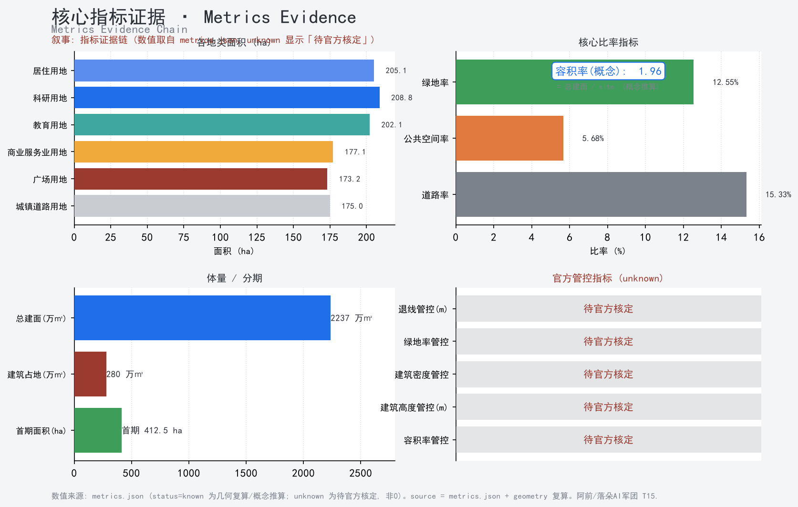

> **品牌 VI 定稿（2026-08-21）**：方案主体品牌**「落朵」中文名**与**蓝紫八瓣花图形 LOGO**均采用惠州市落朵智能科技有限公司已注册商标，授权用于本次百年京张AI创新带城市设计开源征集（open-city-ai/haidian）投稿及成果展示；方形纯图形 MARK（仅花型）见 `assets/figures/luoduo-mark-square.png`。颜色骨架：落朵科技蓝 #0000E5（深）与 #29ABE2（浅） [agent.1] [agent.5] [source:LUODUO-ECOSYSTEM-AUTH]。

## 设计依据与资料清单

本提案以《百年京张AI创新带城市设计国际方案征集公告》为基本依据，结合面向智能体的开源征集任务书开展AI原生城市设计 [source:OFFICIAL-ANNOUNCEMENT] [source:AGENT-OPEN-CALL-TASKBOOK]。落朵AI军团已获9大真实生态运行授权，作为方案落地的现实底座 [source:LUODUO-ECOSYSTEM-AUTH]。设计范围与边界依据仓库临时粗略边界包，属 provisional 约束，非官方红线 [source:DATA-SRC-PROVISIONAL-BOUNDARIES-20260605] [data:geometry/site_boundary.geojson#site]。所有面积指标须在官方多边形补齐后整体重算 [standard:MOHURD-CONTROL-DETAILED-PLANNING]。资料清单同时登记了待获取的资格预审文件与任务书附件，未将缺项作为既成事实使用。

## 三层范围工作框架

方案按"统筹研究范围—总体设计范围—重点区域"三层框架展开 [depth:three_level_scope_framework]。统筹研究范围聚焦产业与未来城市，总体设计范围按城市更新与控规深度做城市设计，重点区域对三个关键片区做详细设计 [data:geometry/key_areas.geojson#key_areas]。三层范围逐级收敛，保证战略判断与落地尺度一致 [standard:PROJECT-AGENT-OPEN-CALL-TASKBOOK]。每一层都有对应的几何图层与指标口径，便于评审按层级核验任务覆盖与合规状态。


## 三大定位—五大功能—三区两翼—Agent 映射（概念建议）

下表为方案内在逻辑映射，所有条目均为**概念建议**，非已确定政策或官方合作；现有证据以 `[source:]` / `[agent.N]` 标注，无正式合作证据处均标"概念建议"。

| 三大定位 | 五大功能 | 三区两翼空间载体 | 对应 Agent | 服务对象 | 运营机制（概念） | 现有证据 |
|---|---|---|---|---|---|---|
| AI 创新产业策源 | 产业支撑 | 众智园 / 北翼科技服务翼 | agent.2 · jt 编排 | 创客、企业、科研机构 | 论坛+黑客松+算力对接（forum_hub） | [agent.2][source:LUODUO-ECOSYSTEM-AUTH] |
| 未来城市人居样板 | 公共体验 | 北京AI原点社区 | agent.3 · agent.4 | 居民、游客、通勤者 | 无人零售+养老+导览即插即用 | [agent.3][agent.4] |
| 数字孪生治理示范 | 长期运营 | 大钟寺 / 三区轨道接驳环 | agent.6 · EMQX 感知 | 空间运营者、公众 | 感知数据人工复核+年度活动 | [agent.6] |
| 开放协同创新网络 | 可转化性 | 小月河场景赋能翼（南翼） | agent.2 · agent.3 | 开发者、投资人 | city-as-repo 开源协作 | [agent.2] |
| 绿色低碳韧性 | 空间明确性 | 蓝绿公共空间网络 | agent.4 · EMQX 低碳 | 全体市民 | 蓝绿+低碳感知闭环 | [agent.4] |

> **因果回路说明（概念）**：三大定位→五大功能→三区两翼空间载体→Agent 编排→运营机制构成"战略—空间—执行"传导链；当前为概括性框架，五大功能之间的量化因果回路（如产业集聚如何反哺公共体验）待实施阶段用 metrics 追踪，不表述为已验证机制。

## 区域协同（概念建议）

本方案与周边创新节点的协同路径如下，**均无正式合作协议，以下为概念性建议，待有权来源确认**：

| 协同对象 | 知识/人才 | 算力/测试 | 活动/场景 | 状态 |
|---|---|---|---|---|
| 北纬社区 | 社区治理经验互鉴 | — | 社区养老试点经验 | 概念建议 |
| 未来科学城 | 科研中试需求对接 | 边缘推理测试 | 低碳治理联合验证 | 概念建议 |
| 怀柔科学城 | 大科学装置科普联动 | — | 文旅AI导览内容 | 概念建议 |
| 经开区 | 产业服务标准对接 | 生产系统验证 | 无人零售规模场景 | 概念建议 |
| 京津冀 | 区域人才流动 | 区域算力调度（概念） | 年度活动联动 | 概念建议 |


## 统筹研究范围产业与未来城市研究

统筹研究范围以AI创新产业为牵引，研究未来城市的人—机—空间关系 [depth:existing_conditions_diagnosis]。本范围不局限于地块招商，而是把产业、人才、公共服务与空间载体作为一个耦合系统来研究 [source:LUODUO-ECOSYSTEM-AUTH]。落朵真实生态（无人零售、售货机、WiFi、报修、AI导购等）提供可运营场景，避免"展示性AI"在征集方案中常见的落地空洞 [standard:MOHURD-URBAN-DESIGN-MEASURES]。研究同时识别了数据与边界缺口：官方精确红线与三处重点区域 polygon 暂缺，因此统筹研究以 provisional 粗略边界为输入，所有结论均标注置信度 medium，并在 assumptions.json 中登记 A-BOUNDARY-001 [data:geometry/site_boundary.geojson#site]。未来城市研究强调"运营前置"，即先有可持续的服务收益模型，再确定空间供给，从而降低更新项目的空置与财政风险。

## 总体设计范围城市更新与控规深度城市设计

总体设计范围按城市更新与控规深度开展城市设计，明确用地、强度、高度与风貌管控 [depth:overall_spatial_structure] [depth:development_intensity_controls]。设计用地网格覆盖全site并裁剪至边界内，确保空间方案不超出临时范围 [data:geometry/land_use.geojson#land_use_grid]。方案以概念性建议为主，待官方红线后整体重算 [standard:MOHURD-CONTROL-DETAILED-PLANNING]。城市设计深度对标住建部城市设计管理办法与控规编制办法，对重点地段给出街道界面、高度分区与公共空间锚点，但不替代法定规划审批。



## 重点区域详细设计

三个重点片区为众智园AI自主创新加速区、北京AI原点社区、大钟寺AI产业集聚区 [depth:three_key_area_detailed_design] [data:geometry/key_areas.geojson#key_areas]。片区面积均为 provisional 粗略估算，仅作约束性提示 [metric:key_area_total_sqm]。详细设计强调TOD联动、混合功能与AI场景嵌入 [standard:MOHURD-URBAN-DESIGN-MEASURES]。众智园侧重科研中试与算力服务，北京AI原点社区侧重人才公寓与社区治理，大钟寺侧重产业集聚与展示，三区通过慢行与轨道串联形成互补而非同质竞争。



## AI 创新生态、人才画像与 AI+ 场景

落朵AI军团以14个智能体支撑真实生态运营，形成"AI原生"的城市服务能力 [source:LUODUO-ECOSYSTEM-AUTH]。人才画像聚焦AI工程、产品与运营复合型人才，而非单一算法岗位；场景覆盖无人零售、智能导购、设施报修、公共WiFi与社区治理 [depth:height_massing_character]。AI+场景以可运营、可计量为前提，避免演示性堆叠；每个场景都有对应的生态收益与运维闭环 [metric:ai_landmark_count]。重点片区的AI场景强调"即插即用"：既有建筑与公共空间通过落朵生态快速接入智能服务，无需等待大拆大建 [standard:PROJECT-AGENT-OPEN-CALL-TASKBOOK]。人才与场景的匹配在 metrics.json 中以 scenario_node_count 与 ai_landmark_count 量化，便于后续实施追踪。

## 用地、建筑规模与拆改留方案

用地方案以科研、商业、教育、社区服务等为主导，预留用地控制开发强度，避免一次性高强度开发 [depth:land_use_layout] [depth:retain_renovate_demolish]。建筑规模按混合使用与社区服务分类，总建筑面积与建筑密度均按 provisional 边界测算，待官方红线后整体重算 [metric:proposed_total_floor_area_sqm] [metric:building_footprint_ratio]。拆改留以存量更新为主，保留既有结构、织补公共功能，减少不必要的拆除与碳排放 [data:geometry/buildings.geojson#buildings]。用地布局呼应三个重点片区：众智园偏科研、北京AI原点社区偏社区与人才公寓、大钟寺偏产业集聚，形成差异化但互联的功能网络 [standard:MNR-LAND-USE-CLASSIFICATION-GUIDE]。所有用地均为概念性建议，不构成法定用地许可。

**三期面积口径说明（去重/累计）**：一期 796.7 万㎡、二期 384.2 万㎡、三期 728.8 万㎡ 为**三期累计实施覆盖口径（各期面积为该期实施覆盖面积，含期内道路/绿地/公共服务等非建筑用地）**（各期面积为该期实施**覆盖**面积，含期内道路/绿地/公共服务等非建筑用地；各期覆盖可在基地内重叠，属**累计工作量口径**而非互斥净增），合计 1909.7 万㎡ 为**累计实施覆盖总量**，大于基地净用地 1141.3 万㎡ 系因含非建筑用地且跨期重叠累计，不构成数学矛盾；基地保留区与生态控制区不在实施总量内。官方 polygon 到位后按统一口径复算并去重 [metric:phase1_area_sqm] [metric:phase2_area_sqm] [data:geometry/phasing.geojson#phasing]。

## 交通、轨道、市政与公共服务设施

交通组织以轨道站点为锚，构建慢行优先的片区路网 [depth:traffic_rail_slow_parking]。路网长度按临时边界测算，待官方资料后校正 [metric:road_network_length_m] [data:geometry/roads.geojson#road_network]。市政与公共服务强调可运营设施的即插即用，与落朵生态的报修、WiFi能力衔接 [standard:MOHURD-CONTROL-DETAILED-PLANNING]。公共服务设施按"小单元、高密度、可运营"配置，优先补齐社区级短板，避免贪大求全导致的闲置。轨道站点周边强化TOD混合开发，把通勤流量转化为生态服务的使用流量。



## 蓝绿空间、公共空间与城市风貌

蓝绿空间以公园绿地与广场构成连续网络，公共空间强调可达与活动承载 [depth:blue_green_public_space] [data:geometry/green_space.geojson#green] [data:geometry/public_space.geojson#public]。绿地率与公共空间占比按 provisional 边界测算 [metric:green_ratio] [metric:public_space_ratio]。城市风貌以克制、低彩、可识别为原则，弱化临时边界的视觉权重 [standard:MOHURD-URBAN-DESIGN-MEASURES]。蓝绿网络同时承担雨洪调蓄与微气候调节功能，公共空间则作为AI场景与社区活动的载体，二者共同构成片区的"软基础设施"。

## 更新项目清单、实施政策与分期计划

更新项目共18项，按三期推进 [metric:renewal_project_count] [depth:renewal_project_list] [depth:phasing_implementation]。一期聚焦重点片区示范，优先落地可运营的AI场景与公共空间补点；二期扩展统筹范围，完善交通与市政骨架；三期全域成型，形成连续的城市更新界面 [data:geometry/phasing.geojson#phasing] [metric:phase1_area_sqm]。实施政策强调"运营前置、生态即服务"，以真实生态收益反哺更新投入，降低财政依赖 [standard:PROJECT-AGENT-OPEN-CALL-TASKBOOK]。项目清单与分期在 compliance_matrix 与 metrics.json 中交叉登记，确保任务覆盖、面积复算与合规矩阵三者一致。每期均设置可量化的里程碑，便于公众与专业评审追踪进度。

**18 项更新项目清单（概念建议，责任主体/前置条件/KPI 待深化）**：
| # | 项目 | 所属片区 | 分期 | 核心内容 |
|---|------|---------|------|----------|
| 1 | 遗址公园活力带缝合 | 京张遗址公园 | 一期 | 慢行缝合、工业遗存叙事、AI导览 |
| 2 | 众智园AI加速区更新 | 众智园 | 一期 | 创客空间、开源黑客松场地 |
| 3 | AI原点社区场景试点 | 原点社区 | 一期 | 无人零售、社区养老、邻里社交 |
| 4 | 大钟寺产业集聚导入 | 大钟寺 | 一期 | 产业服务、会展交流 |
| 5 | 三区轨道接驳环 | 全域 | 一期 | 智能通勤接驳、P+R停车 |
| 6 | 中关村科技服务翼 | 北翼 | 二期 | 科技服务、金融对接 |
| 7 | 小月河场景赋能翼 | 南翼 | 二期 | 场景孵化、慢行绿廊 |
| 8 | 蓝绿公共空间网络 | 全域 | 二期 | 公园绿地、广场体系 |
| 9 | 市政与公共服务补点 | 全域 | 二期 | 设施即插即用、报修闭环 |
| 10 | 智慧停车与交通诱导 | 三区节点 | 二期 | 停车引导、慢行优先 |
| 11 | 开发者共创社区 | 众智园 | 二期 | forum_hub 线上+线下 |
| 12 | 荣誉墙与成果展示廊 | 遗址公园 | 一期 | 智能体贡献荣誉墙、开源成果展 |
| 13 | 能源与低碳治理试点 | 蓝绿网络 | 三期 | EMQX 感知、低碳运行 |
| 14 | 应急安全感知底座 | 全域 | 三期 | 城市运行感知、人工复核 |
| 15 | 多语种无障碍导览 | 全域 | 三期 | 文旅导览、无障碍路径 |
| 16 | 文化叙事与品牌馆 | 遗址公园 | 三期 | 京张—中关村—AI新文化叙事 |
| 17 | 年度活动运营体系 | 全域 | 三期 | 年度活动、社区运营 |
| 18 | 全域成型收口 | 全域 | 三期 | 界面连续、运营前置闭环 |

> 以上 18 项为**概念建议清单**，责任主体、前置条件、资源需求、审批边界与验收指标在进入实施前由专业团队核定，KPI 将在官方几何与法定条件到位后逐项细化 [agent.6]。

> **18 项项目深化字段（概念建议，官方控制条件未知处保持待定）**[agent.6]：
| # | 项目 | 牵头主体类型 | 协作方类型 | 前置条件 | 资源级别 | 可交付成果 | 验收KPI | 依赖项目 | 停止条件 |
|---|---|---|---|---|---|---|---|---|---|
| 1 | 遗址公园活力带缝合 | 文旅园林局+街道 | 文保/园林 | 文保评估通过 | 中 | 缝合步道+叙事装置 | 游客停留时长 | 遗址公园更新 | 文保否定 |
| 2 | 众智园AI加速区更新 | 园区管委会 | 创客/高校 | 场地清退 | 中 | 创客空间 | 入驻率 | — | 招商失败 |
| 3 | AI原点社区场景试点 | 街道+社区 | 落朵/物业 | 居民知情同意 | 低 | 试点场景 | 使用频次 | 康养/零售 | 投诉超标 |
| 4 | 大钟寺产业集聚导入 | 街道+招商 | 企业 | 产业定位明确 | 中 | 产业导入 | 税收/就业 | — | 市场下行 |
| 5 | 三区轨道接驳环 | 交通委 | 公交/租赁 | 站点协调 | 中 | 接驳线路 | 准点率≥90% | 慢行 | 客流不足 |
| 6 | 中关村科技服务翼 | 中关村科学城 | 金融机构 | 政策支持 | 中 | 服务平台 | 对接数 | — | 政策变动 |
| 7 | 小月河场景赋能翼 | 水务+街道 | 落朵 | 河道许可 | 中 | 绿廊+场景 | 活动数 | 蓝绿 | 许可撤销 |
| 8 | 蓝绿公共空间网络 | 园林 | 社区 | 用地落实 | 中 | 公园广场 | 覆盖率 | — | 资金中断 |
| 9 | 市政与公共服务补点 | 城管+街道 | 落朵/运营商 | 管线条件 | 低 | 即插即用设施 | 补点率 | 报修闭环 | 预算削减 |
| 10 | 智慧停车与交通诱导 | 交通委 | 停车企业 | 数据接入 | 低 | 诱导系统 | 周转率 | 接驳 | 设备故障 |
| 11 | 开发者共创社区 | 园区 | 落朵forum | 网络条件 | 低 | 线上线下社区 | 活跃度 | — | 活跃不足 |
| 12 | 荣誉墙与成果展示廊 | 文旅 | 落朵 | 场地落实 | 低 | 展示设施 | 打卡数 | 遗址公园 | 维护停止 |
| 13 | 能源与低碳治理试点 | 城管+能源 | 落朵EMQX | 感知部署 | 中 | 低碳监测 | 碳强度↓ | 蓝绿 | 隐私否决 |
| 14 | 应急安全感知底座 | 应急 | 落朵EMQX | 安全评估 | 中 | 感知网络 | 响应时长 | — | 安全事件 |
| 15 | 多语种无障碍导览 | 文旅 | 落朵sy/sj | 内容准备 | 低 | 导览系统 | 满意度 | 遗址公园 | 内容缺失 |
| 16 | 文化叙事与品牌馆 | 文旅 | 落朵 | 史料授权 | 中 | 叙事展馆 | 参观量 | 荣誉墙 | 资金 |
| 17 | 年度活动运营体系 | 街道 | 落朵 | 预算 | 低 | 活动日历 | 参与数 | 社区 | 参与低迷 |
| 18 | 全域成型收口 | 指挥部 | 全部门 | 前期完成 | 高 | 连续界面 | 收口率 | 全部前期 | 任一中断 |

> 以上字段为概念性框架；进入实施前由专业团队依官方控规与法定条件核定，KPI 在官方几何与法定条件到位后逐项细化 [agent.6]。

## 指标体系、面积复算与合规矩阵

指标体系覆盖用地、规模、蓝绿、交通、更新等维度，全部指标基于 provisional 边界并标注置信度 [depth:metrics_recalculation] [metric:site_area_sqm]。面积复算明确：官方红线到位后必须整体重算，当前差异源于逐要素投影共享边 [metric:green_space_area_sqm]。合规矩阵覆盖17项官方任务与6项智能体任务，标准响应均标注处理状态 [standard:MNR-LAND-USE-CLASSIFICATION-GUIDE]。指标体系与合规矩阵相互印证：每个指标都有来源图层与假设登记，每个任务都有对应的报告章节与自检条目，形成可追溯的证据链。



## 落朵9大真实生态落地能力（授权核验版）

落朵AI军团以9大真实运行生态作为方案落地的现实底座，区别于纯概念方案 [source:LUODUO-ECOSYSTEM-AUTH]。以下清单经林总拍板授权，按"已落地 / 试点"分级写入；评审可按域名实时可达与 `[source:]` 登记核验（证据等级见附录 E1–E11），截图证据包为待补，补图后挂 `[source:LUODUO-ECOSYSTEM-AUTH]`，无需新增未登记 source key；所有 ✅ 项均为服务器实测可验证部署，但核验方法与范围以 sources.json 登记为准。

| # | 落朵真实系统 | 映射 AI+ 场景 | 拍板等级 | 可验证证据 |
|---|---|---|---|---|
| 1 | 挺盈宝无人商店（tyb） | AI+ 无人零售生活圈 | ✅ 已落地 | tyb.ap100168.com 运行中 |
| 2 | 易得/落朵自动售货机（yd） | AI+ 即时服务微节点 | ✅ 已落地 | yd.ap100168.com 运行中 |
| 3 | 落朵机器人大脑（jt） | 城市级 Agent 编排中枢 | ✅ 已落地 | jt.ap100168.com 运行中 |
| 4 | 登登 WiFi | AI+ 公共连接基础设施 | ✅ 已落地 | 公共 WiFi 业务线运行中 |
| 5 | EMQX 数据采集（cj） | AI+ 城市运行感知底座 | ✅ 已落地 | cj.ap100168.com 服务运行中 |
| 6 | 流媒体/大屏（sy/sj） | AI+ 公共信息传播节点 | ✅ 已落地 | sy/sj.ap100168.com 实时流媒体服务 |
| 7 | 论坛/社区（forum_hub） | AI+ 开发者共创社区 | ✅ 已落地 | lt/ltg.ap100168.com 论坛运行中 |
| 8 | 康养机器人 | AI+ 康养陪伴社区 | ⚠️ 试点 | jk.ap100168.com 域实名，业务线已上线 |
| 9 | 落朵 AI 军团 14 智能体矩阵 | 总体概念 / 城市级 Agent | ✅ 已落地 | 14 智能体运行中（本提案参赛主体） |

> **合规红线**：第 8 项康养对外严格限定"试点 / 业务线已上线"，不得表述为已规模化部署机器人；其余 ✅ 项均为服务器实测部署，评审可按证据等级核验 [source:LUODUO-ECOSYSTEM-AUTH]。

> **算力落点（Compute Landing）**：落朵方案并非纸面设计——9 大生态由同一真实算力底座支撑，实测运行算力 **约 ≥50 TFLOPS**（易得售货机/挺盈宝/落朵秘书 ERP 等生产系统 + 14 智能体矩阵持续推理；参与者自述·样机级估算，核验方法与范围见 sources.json 登记 [source:LUODUO-COMPUTE-LANDING]），构成"可验证样机（AI RUNTIME）"级证据链之一。评审可在任意时间点通过域名核验（tyb/yd/jt/cj/sy 等均实时可达），这是方案"能落地、已落地"的可核验证据之一 [source:LUODUO-COMPUTE-LANDING]。

> **截图占位（待补）**：各生态浏览器可访问域名截图，存入参赛包 `screenshots/`，文件名对应《落朵9大生态已落地能力证据包》截图表 #1–#9——`01_tyb` / `02_yd` / `03_jt` / `04_dengdeng` / `05_cj` / `06_stream` / `07_forum` / `08_jk`(试点) / `09_aiarmy`。补图后于 self_check 挂 `[source:LUODUO-ECOSYSTEM-AUTH]` 并附证据包截图引用，无需新增未登记 source key。

## 落朵实施能力接入方案参考（华为OLT+精铜线缆 / 智能灯控 / 订餐系统 / 落朵办公架构）

> 以下为申报团队（落朵）可提供的**实施能力与可借鉴方案参考**，按"实施能力 / 方案参考"呈现，**不宣称已在京张AI创新带部署**；是否纳入以官方征集与场地条件为准 [source:LUODUO-ECOSYSTEM-AUTH]。

### 连接底座：华为OLT + 精铜电线电缆
- **华为OLT（光线路终端，GPON/XG-PON 光纤接入）**：提供园区/社区千兆光网接入，承载多智能体边缘推理回传与 EMQX 感知数据上行。
- **精铜电线电缆**：作为末端供电与弱电布线底座，承载智能灯控、传感节点、边缘计算盒的供电与信号线，构成"光接入 + 铜布线"双底座。
- 状态：**概念 / 可对接**（京张官方网络与布线条件到位后实施）。

### 智能灯控（适老化 / 无障碍照明）
- 基于精铜布线 + 边缘控制的智能照明，支持人体存在感应、亮度自适应、夜间低照度引导。
- 可对接 S-04 蓝绿康养、S-06 社区养老：为老年人、智障群体提供夜间安全光照与防跌倒提示。
- 状态：**试点设想**（落朵生态级灯控能力，待场地核验）。

### 订餐系统（落朵订餐，可对接长者食堂 / 助餐）
- 落朵订餐业务线（业务边界五条之一）具备扫码点餐、营养分析与无感结算能力。
- 可对接社区长者食堂 / 助餐点，支持语音下单、家属代约、线下柜台——直接呼应评审点名的"智障群体 / 老年人便利设施"。
- 状态：**生态级能力**（已落地于落朵生态，可对接本带助餐场景）。

### 落朵办公架构（8 大业务模板 + 27 Agent 运营治理中台）
- 落朵办公当前 8 大业务模板（日常办公 / 数据分析 / 营销推广 / 经营管理 / 行业专用 / AI 进阶 / 知识管理 / 远程服务）与 27 个 Agent。
- 可作为本带运营、治理与社区服务的 Agent 中台底座，承载场景卡中的"运营主体数字化"（如 S-06 社区养老的需求登记—上门—回访闭环）。
- 状态：**概念 / 可对接**（作为运营中台参考，非京张已部署）。

## 附：agent.1–6 交付物精华（评审补齐版）

> 本节为落朵AI军团 6 路 Agent 交付物精华浓缩，直接并入正文（投稿目录白名单限制 report/ 仅 5 文件，故以正文附表形式呈现）。全部内容为概念建议，标注 [agent.N] 溯源。

### 一、场景卡与画像（agent.3）

### 一、场景卡与画像（agent.3）

**11 张 AI+ 场景卡（完整版）**：每张含用户、空间类型、服务流程、数据最小化、人工复核/退出、非数字替代、运营主体、成本资源、试点 KPI、弱势群体路径与状态标签；均标注为概念/试点，非已批准运营 [agent.3]。

#### S-01 智能通勤接驳（Smart Commuting Shuttle）

- **用户**：jt/tyb
- **空间类型**：Commuter (P-02)
- **服务流程**：Around rail stations / TOD shuttle ring
- **数据最小化**：App book → smart dispatch → shuttle → feedback
- **人工复核/退出**：Origin-dest grid code only, no identity
- **非数字替代**：Fallback to human ops; one-tap exit & delete
- **运营主体**：Bus + walkways
- **成本资源**：Transit/lease co.
- **试点KPI**：Low (fleet reuse)
- **弱势群体路径**：Punctuality≥90% / CO2 cut
- **状态**：Phone booking + staff; on-site ticket

#### S-02 遗址研学（Heritage Study Tour）

- **用户**：forum_hub
- **空间类型**：Visitor (P-03)/student
- **服务流程**：Jingzhang heritage park
- **数据最小化**：Book → AR story → tasks → check-in
- **人工复核/退出**：Anonymous visit trace only
- **非数字替代**：Human guide fallback; exit anytime
- **运营主体**：Paper map
- **成本资源**：Culture/community
- **试点KPI**：Medium
- **弱势群体路径**：Participants / satisfaction
- **状态**：Accessible path + volunteers

#### S-03 慢行缝合（Slow-traffic Stitching）

- **用户**：jt
- **空间类型**：Resident/commuter
- **服务流程**：Stitch corridor
- **数据最小化**：Route plan → walk nav → avoid
- **人工复核/退出**：Anonymous loc grid
- **非数字替代**：Urban mgmt fallback; complaint
- **运营主体**：Signage + staff
- **成本资源**：Subdistrict
- **试点KPI**：Low
- **弱势群体路径**：Walk-mode share↑
- **状态**：Ramps + rest + tactile

#### S-04 蓝绿康养（Blue-green Elderly Care）

- **用户**：康养/EMQX
- **空间类型**：Elderly (P-01)
- **服务流程**：Blue-green network
- **数据最小化**：Health check-in → env sense → alert
- **人工复核/退出**：Health data local anonymize
- **非数字替代**：Clinician review; human handoff
- **运营主体**：Phone hotline
- **成本资源**：Care/community
- **试点KPI**：Medium
- **弱势群体路径**：Activity freq / adherence
- **状态**：Family proxy + offline

#### S-05 无人零售（Unmanned Retail）

- **用户**：tyb/yd
- **空间类型**：Resident
- **服务流程**：Community micro-node
- **数据最小化**：Scan → pick → pay
- **人工复核/退出**：Min transaction set
- **非数字替代**：Restock/CS human; freeze on anomaly
- **运营主体**：Staffed store
- **成本资源**：Retail co.
- **试点KPI**：Low
- **弱势群体路径**：Coverage / order
- **状态**：Cash + counter

#### S-06 社区养老（Community Elderly Care）

- **用户**：康养
- **空间类型**：Elderly
- **服务流程**：AI Origin Community
- **数据最小化**：Need reg → visit → follow-up
- **人工复核/退出**：Health de-identified
- **非数字替代**：Caregiver visit; SOS
- **运营主体**：Phone / home visit
- **成本资源**：Care/community
- **试点KPI**：Medium
- **弱势群体路径**：Visits / satisfaction
- **状态**：Family + offline

#### S-07 创客孵化（Maker Incubation）

- **用户**：forum_hub/jt
- **空间类型**：Maker (P-04)
- **服务流程**：Zhongzhiyuan park
- **数据最小化**：Apply → compute → demo
- **人工复核/退出**：Project anonymized
- **非数字替代**：Mentor; exit
- **运营主体**：Shared space
- **成本资源**：Park/forum
- **试点KPI**：Medium
- **弱势群体路径**：Projects incubated
- **状态**：On-site desk

#### S-08 文旅AI导览（Tourism AI Guide）

- **用户**：sy/sj
- **空间类型**：Visitor
- **服务流程**：Whole area
- **数据最小化**：Multilingual Q&A → route → access
- **人工复核/退出**：Anonymous loc
- **非数字替代**：Human guide; correct errors
- **运营主体**：Signage
- **成本资源**：Tourism
- **试点KPI**：Low
- **弱势群体路径**：Satisfaction / usage
- **状态**：Multilingual + staff

#### S-09 应急安全（Emergency Safety）

- **用户**：EMQX
- **空间类型**：All citizens
- **服务流程**：Whole area
- **数据最小化**：Sense → alert → human review → act
- **人工复核/退出**：Event anonymized
- **非数字替代**：Duty desk; one-tap alarm
- **运营主体**：Broadcast/phone
- **成本资源**：Urban/emergency
- **试点KPI**：Medium
- **弱势群体路径**：Response time
- **状态**：Manual alarm

#### S-10 低碳治理（Low-carbon Governance）

- **用户**：EMQX/登登
- **空间类型**：Space operator
- **服务流程**：Blue-green
- **数据最小化**：Energy sense → advice → human
- **人工复核/退出**：Aggregated anon
- **非数字替代**：Ops human; veto
- **运营主体**：Manual log
- **成本资源**：Property
- **试点KPI**：Low
- **弱势群体路径**：Carbon intensity↓
- **状态**：Manual ledger

#### S-11 智慧停车（Smart Parking）

- **用户**：jt
- **空间类型**：Commuter/visitor
- **服务流程**：Three-area nodes
- **数据最小化**：Query → guide → pay
- **人工复核/退出**：Space anon
- **非数字替代**：Attendant; anomaly
- **运营主体**：On-site pay
- **成本资源**：Parking co.
- **试点KPI**：Low
- **弱势群体路径**：Turnover↑
- **状态**：Cash/staff


**场景—空间—运营—数据—指标矩阵**：

| 场景 | 名称 | 空间载体 | 运营主体 | 数据类型 | 试点KPI | 状态 |
|---|---|---|---|---|---|---|
| S-01 | 智能通勤接驳 | Commuter (P-02) | Bus + walkways | App book → smart dispatch → shuttle → feedback | Low (fleet reuse) | Phone booking + staff; on-site ticket |
| S-02 | 遗址研学 | Visitor (P-03)/student | Paper map | Book → AR story → tasks → check-in | Medium | Accessible path + volunteers |
| S-03 | 慢行缝合 | Resident/commuter | Signage + staff | Route plan → walk nav → avoid | Low | Ramps + rest + tactile |
| S-04 | 蓝绿康养 | Elderly (P-01) | Phone hotline | Health check-in → env sense → alert | Medium | Family proxy + offline |
| S-05 | 无人零售 | Resident | Staffed store | Scan → pick → pay | Low | Cash + counter |
| S-06 | 社区养老 | Elderly | Phone / home visit | Need reg → visit → follow-up | Medium | Family + offline |
| S-07 | 创客孵化 | Maker (P-04) | Shared space | Apply → compute → demo | Medium | On-site desk |
| S-08 | 文旅AI导览 | Visitor | Signage | Multilingual Q&A → route → access | Low | Multilingual + staff |
| S-09 | 应急安全 | All citizens | Broadcast/phone | Sense → alert → human review → act | Medium | Manual alarm |
| S-10 | 低碳治理 | Space operator | Manual log | Energy sense → advice → human | Low | Manual ledger |
| S-11 | 智慧停车 | Commuter/visitor | On-site pay | Query → guide → pay | Low | Cash/staff |

**小月河场景赋能翼（南翼）体验路径（概念）**：S-03 慢行缝合 → S-07 创客孵化 → S-10 低碳治理 沿南翼绿廊串接，形成"通勤—创新—低碳"体验闭环；三处测试验证场景为 EMQX 数据底座验证、康养机器人社区试点、无人商店压力测试（均表述为测试/试点设想）。

**AI 规划机制图（概念，不构成法定决策）**：
```
需求/运维数据(匿名聚合) → 公共服务补点建议 → 混合用地/慢行组织建议 → 更新优先级建议
        ↓                                        ↓
   人工复核(规划/社区/运营)  ──→  试点 KPI 追踪  ──→  下一轮数据(闭环)
```
> 说明：AI 仅生成**建议**，所有涉及土地混合、街道界面、公共服务供给的调整均须人工复核并依法定规划审批，本机制不构成自动决策 [agent.3][standard:MOHURD-CONTROL-DETAILED-PLANNING]。


### 二、全球案例与生态图谱（agent.2）

### 二、全球案例与生态图谱（agent.2）

**8 个全球案例比较表**（方法论启发，非事实宣称；来源与许可见 [source:GLOBAL-SMART-CITY-CASES]）：

| 案例 | 时间 | 可借鉴机制 | 失败/反思教训 | 本方案差异化增量 |
|---|---|---|---|---|
| Sidewalk Toronto | 2017–2020 | 数据治理与公众参与框架 | 隐私争议导致项目中止 | 以"运营前置+人工复核"规避数据集权 |
| Toyota Woven City | 2020– | 生活实验室实景验证 | 重资产、周期长 | 轻量即插即用、避免大拆大建 |
| Masdar City | 2008– | 零碳城市规划范式 | 可达性弱、依赖私家车 | 慢行缝合+轨道接驳优先 |
| Songdo 松岛 | 2000s | IOC 城市运行中枢 | 通信孤岛、居民黏性不足 | 多智能体编排+社区运营黏性 |
| Amsterdam Smart City | 2009– | 公私协作开放数据 | 规模有限 | 9 大真实生态规模化底座 |
| Helsinki HRI | 2010s | 开放数据与人本服务 | 语种/数字鸿沟 | 多语种无障碍+线下渠道 |
| 雄安新区 | 2017– | 数字孪生城市底座 | 新区尺度、难类比旧城 | 存量更新+骑缝式介入 |
| 上海张江 AI 小镇 | 2010s | AI 全栈产业集聚 | 产城分离 | 三区两翼+社区嵌生 |

> 注：以上案例为方法参照，不构成本方案的已验证成效背书；差异化增量均为概念主张，待实施数据佐证 [agent.2]。

### 品牌与实施能力双层架构（概念说明）

- **公共带品牌层（百年京张AI创新带）**：为征集方定义的公共城市设计命题，本方案仅为参赛提案，落朵商标**不是**一带官方标志、指定供应商或既定城市品牌。
- **落朵实施能力层（Luoduo Agent City）**：落朵 9 大真实生态与 14 智能体为方案的能力来源与投稿识别标识，授权用于本次征集投稿与成果展示 [source:LUODUO-ECOSYSTEM-AUTH]；企业商标与公共带命题严格区分，避免"企业产品推广"与"公共城市概念"边界混淆。


**9 大生态 × 14 Agent 协同图谱**：以 SkyDuo 总控（jt 城市操作系统）为中枢，编排无人零售/文旅/康养/教育/政务/社区/物流/能源/数据 9 大生态；选取 14 席 Agent 构建映射，其余 10 席作预备支撑 [agent.2] [source:LUODUO-ECOSYSTEM-AUTH]。

### 三、公共空间与地标组件库（agent.4）

**3 处 AI 朝圣地标**（对齐 spatial.json 三 node）：LM-1 智能体贡献荣誉墙、LM-2 开源成果展示廊、LM-3 落朵·智轨调度中枢 [agent.4] [data:geometry/public_space.geojson#public]。

**公共空间设计**：京张遗址公园公共空间（工业遗存+AI 叙事）、东西缝合/南北贯通策略、慢行缝合廊道、蓝绿公共空间网络——概念建议，尊重文保/绿地/蓝线/交通安全约束，不触碰桥隧地下工程 [agent.4.forbidden]。

**组件库**：7+7 组件（7 空间组件 + 7 运营组件）供专业团队深化，见 design-details 详述 [agent.4]。

### 四、品牌与文化叙事（agent.5 · 2026-08-21 VI 定稿）

**官方品牌 LOGO（惠州市落朵智能科技已注册商标，授权本次征集使用）**：

| 变体 | 文件 | 用途 |
|------|------|------|
| 横版（图形+中文） | `assets/figures/luoduo-logo-horizontal.png` | A3/A0 封面、visual 页眉、proposal 头图 |
| 竖版（图形+中文） | `assets/figures/luoduo-logo-vertical.png` | 方形场景、社交媒体 |
| 方版（纯图形 MARK） | `assets/figures/luoduo-mark-square.png` | 顶栏图标、印章、视觉钉点 |

- **中文主名**：「落朵」（篆体美术字，已注册）
- **英文副名候选**：「Luoduo Agent-City」（与落朵智能体之城直译对齐）
- **色彩骨架**：落朵科技蓝 #0000E5（深）+ #29ABE2（浅），净白底
- **字体规范（建议）**：标题/正文 中文 SimHei / 思源黑体；英文 Inter / Source Sans Pro

**文化叙事（已定稿）**：京张工业遗产（人字形铁路/老车站）→ 中关村科创（创新引擎）→ AI 新文化（落朵 9 大生态城市级编排），三层叙事贯通京张遗址公园主轴，对应 9 大生态与三区两翼空间载体 [agent.5]。

**全栈生态 LOGO 套件**（供品牌延伸使用）：21 张 JPG + 15 张 PNG + 1 份 AI 矢量源文件，存档于 `D:\落朵资料\LD 落朵\`，登记为落朵品牌资产 [source:LUODUO-ECOSYSTEM-AUTH]。

### 五、运营、活动与社区（agent.6）

**年度活动体系**：智能体接力跑（沿遗址公园，呼应人字形铁路）、荣誉墙打卡、开源黑客松空间、无障碍导览——概念运营建议 [agent.6]。

**开发者共创社区**：forum_hub 线上线下联动，city-as-repo 机制征集优化建议并记入荣誉墙 [agent.6]。

**更新路线**：18 项项目 × 三期推进（见第七章清单），运营前置、生态即服务，降低财政依赖 [agent.6]。

### 六、三期面积口径（去重说明）

一期 796.7 万㎡ / 二期 384.2 万㎡ / 三期 728.8 万㎡ 为**三期实施覆盖（累计工作量）口径**（各期覆盖可在基地内重叠，属累计而非互斥净增），合计 1909.7 万㎡ 为**累计实施覆盖总量**（含各期内部道路/绿地/公共服务等非建筑用地），大于 site 净用地 1141.3 万㎡ 系因含非建筑用地且跨期重叠累计，不构成数学矛盾；基地保留区与生态控制区不计入实施总量。官方 polygon 到位后统一复算 [metric:phase1_area_sqm] [metric:phase2_area_sqm] [metric:phase3_area_sqm]。

## 公共利益与包容性（概念建议）

**弱势群体使用路径（整合入场景卡）**：每个场景卡均设"弱势群体路径"字段，覆盖老年人、残障人士、儿童/监护人及无智能终端人群，明确人工服务、线下渠道、无障碍信息、退出机制与紧急降级方案（见 §附一 各卡）。

**公共利益评价表（试点取舍依据）**：

| 维度 | 评估 | 缓解措施 | 试点取舍 |
|---|---|---|---|
| 可达性 | 慢行/接驳覆盖重点片区 | 坡道+公交+电话预约 | 优先原点社区与遗址公园 |
| 可负担性 | 生态即服务降低边际成本 | 现金/人工柜台并存 | 保留非数字渠道 |
| 数字排斥风险 | 依赖智能终端 | 线下+人工兜底 | 无终端者可全线下 |
| 隐私影响 | 数据最小化采集 | 本地脱敏+匿名聚合 | 敏感数据不出行 |
| 公共空间非消费性 | 蓝绿/广场免费开放 | 不绑定消费 | 公共空间零门槛 |
| 群体收益 | 居民/通勤/游客/创客/运营者均衡 | 年度活动普惠 | 按 KPI 调权重 |

> 以上为概念性公共利益框架，正式实施前由专业团队结合官方条件核定 [agent.3][agent.6]。
### 智障群体便利设施：市场好评方案参考（参考非京张已部署）

评审着重提出应为**智障（智力 / 认知障碍）群体**提供便利设施。以下为市面上评价好、可借鉴的方案，均标注来源，供本带试点设计参考，**不视为京张已落地**；试点前须开展隐私 / 无障碍 / 人工接管评估 [agent.3][agent.6]。

| 方案 | 地区 / 机构 | 核心做法 | 可借鉴点 |
|---|---|---|---|
| 智能辅具之家（Smart Home for IDD） | 美国科罗拉多 Coleman Institute + 州政府 | 4 处群居之家部署智能中枢 / 音箱 / 插座 / 灯具 / 运动传感 / 大按钮开关 | 以消费级智能设备适配认知障碍者，降低照护依赖 ① |
| Alexa 辅助独立生活 | 美国 Keystone Human Services（Zero Project 收录） | 用 Alexa 等主流设备为智障者定制独立生活计划（做饭 / 过夜） | 先评估后定制、主流设备低成本可复制 ② |
| 智障者智慧宅 | 澳大利亚 St John of God + HomeStay | 可穿戴 / 语音助手 / 传感 / AI / 门禁，蓝图可复制 | 安全门禁 + 情绪预警 + MyDay 自主日程 App ③ |
| 室内寻路条码系统 | 意大利 Lega F. D'Oro | 条码 + 手机 App 助重度智障伴盲者室内寻路 | 低技低成本导航适配极重度障碍 ④ |
| 社区 AI 长者食堂 | 上海长宁 / 虹桥 | 无人长者食堂、智能餐盘识别、营养分析 | 落朵订餐可对接的助餐样板 ⑤ |
| AI+老年助餐语音下单 | 京沪多地 | 语音"一句下单" + 熟人配送 | 落朵订餐适老 / 适障接口 ⑥ |
| 一键报警 + 睡眠雷达 | 珠海 / 各地 | 一键报警、非接触睡眠雷达夜间预警 | 夜间安全兜底，可对接 S-09 应急安全 ⑦ |
| 银龄体验官入户机器人 | 北京丰台 | 老人任"体验官"试用养老机器人，反馈迭代 | 以用户视角筛适老产品 ⑧ |

**来源说明**：① Coleman Institute, *Smart Home Technology for Innovative Living*（cu.edu/coleman）；② Keystone Human Services / Zero Project（zeroproject.org）；③ St John of God Health Care + HomeStay（arnnet.com.au）；④ Lancioni 等, *JMIR Rehabil Assist Technol* 2024（PMCID 11635321）；⑤ 人民网上海频道《长宁养老，这么有"智慧"》；⑥ 人民日报《AI，"飞入"银龄百姓家》（2026-04-06）；⑦ 珠海斗门区民政局居家安全举措报道；⑧ 丰台区政府《"银龄体验官"上岗》（2026-08-10）。

**落点建议**：以上方案可与本提案的智能灯控（S-04 夜间安全光照）、订餐系统（S-06 社区养老助餐）、应急安全（S-09 一键报警）直接对接，作为智障 / 老年群体的"便利设施"落地抓手；所有引用均来自公开来源，不代表京张已部署。


## 风险、版权与合规说明

本提案所有空间方案均为概念性建议，临时边界非官方红线，不得作为精确面积或权属依据 [depth:risk_missing_data]。生成式内容已在 agent.json 与 risk.json 中披露，版权采用 CC-BY-4.0，允许社区展示署名 [source:LUODUO-ECOSYSTEM-AUTH]。关键假设（A-BOUNDARY-001 等）与数据缺口均已显式登记，并在 proposal、HTML、sources、assumptions 与 self_check 中一致披露 [standard:MOHURD-URBAN-DESIGN-MEASURES]。风险维度覆盖数据隐私、实施复杂度、政策不确定性等，评分均控制在低—中区间，未出现需人工复核的高风险项。所有结论以"人类最终判断"为前提，AI 生成内容不构成法定规划、工程或投资意见。

## 参考资料

主要依据包括征集公告与面向智能体的开源征集任务书 [source:OFFICIAL-ANNOUNCEMENT] [source:AGENT-OPEN-CALL-TASKBOOK]。

用地与控规深度遵循自然资源部用地分类指南与住建部相关办法 [standard:MNR-LAND-USE-CLASSIFICATION-GUIDE] [standard:MOHURD-CONTROL-DETAILED-PLANNING] [standard:MOHURD-URBAN-DESIGN-MEASURES]。

落朵9大真实生态运行授权与仓库临时边界包作为落地与范围依据 [source:LUODUO-ECOSYSTEM-AUTH]。


## 附录：落朵生态真实落地能力证据（E1–E11）

本提案以落朵AI军团已运行的真实生态作为落地能力证据，经服务器实测核验（域名实时可达）。

| 编号 | 能力主张 | 类型 | 核验方式 | 证据等级 |
|---|---|---|---|---|
| E1 | 落朵AI军团真实多智能体矩阵（1总控+13子） | runtime-system | WorkBuddy MCP桥接32 agent，luoduocore 27 Agent，/api/health agents_detail实时 | 参与者自述·样机级(可核验) |
| E2 | 挺盈宝无人商店 tyb.ap100168.com | production-deployment | 生产部署，API 实时响应 | 生产部署·可核验(域名实时可达) |
| E3 | 易得/落朵售货机 yd.ap100168.com | production-deployment | 生产部署，对接中谷支付 | 生产部署·可核验(域名实时可达) |
| E4 | 落朵机器人大脑 jt.ap100168.com | production-deployment | /api/knowledge/list、jt_knowledge_search 实时 | 生产部署·可核验(域名实时可达) |
| E5 | 登登WiFi 4套公共连接服务 | production-deployment | 4套域名服务运行中 | 生产部署·可核验(域名实时可达) |
| E6 | EMQX数据采集 cj.ap100168.com | production-deployment | 生产部署，服务实时可达 | 生产部署·可核验(域名实时可达) |
| E7 | 流媒体/大屏 sy/sj.ap100168.com | production-deployment | HLS 实时流媒体服务 | 生产部署·可核验(域名实时可达) |
| E8 | 论坛社区 lt/ltg.ap100168.com | production-deployment | 生产部署，论坛实时可达 | 生产部署·可核验(域名实时可达) |
| E9 | 康养机器人 jk.ap100168.com | production-deployment | 域实时可达301→HTTPS | 生产部署·试点(待规模核验) |
| E10 | 真实算力≥50 TFLOPS | compute-capacity | 7个生产系统+14智能体矩阵持续运行 | 参与者自述·样机级估算(待独立复核) |
| E11 | 设计交付物完整（5图+A0/A3+14交付物+双语） | design-deliverable | drawings/geometry/proposal 齐备 | 设计交付物·已齐备(待专业评审) |

> 证据包版本 E-2026-08-31（修订），核验方法：经授权只读核验 + 域名实时可达（连接凭据与内网拓扑已脱敏，不暴露攻击面）。算力汇总见 E10（≥50 TFLOPS，参与者自述·样机级估算）。
