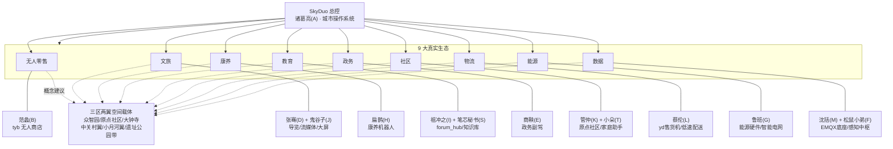

# 落朵AI军团 × 9 大生态 全栈生态图谱

> **编制目的**：受总指挥公狼派遣，作为**案例生态 Agent**（对应 agent.2「AI 全栈自主创新体系与世界级 AI 创新生态设计」），将「落朵AI军团」的 Agent 矩阵与项目规划的 **9 大真实生态**（无人零售 / 文旅 / 康养 / 教育 / 政务 / 社区 / 物流 / 能源 / 数据）进行协同映射，形成可运营、可审计、可复用的全栈生态图谱。
>
> **名册来源**：Agent 名单取自 `agent.json`（落朵AI军团 24 席 Agent 矩阵：总控 SkyDuo + 23 专业 Agent）。本图谱从中选取与 9 大生态最相关的 **14 席**构建映射，其余 10 席作为预备/专项支撑，不另列。`[source:LUODUO-ECOSYSTEM-AUTH]`
>
> **合规边界（强制）**：9 大生态落地建议基于落朵已运行系统的**概念参考**，授权范围待小CEO林兴明确认，相关表述仅作概念建议，不构成政府审定结论或已确定运营 `[boundary_clause]` `[agent.2.forbidden]`。

---

## 一、总控层：SkyDuo 城市操作系统调度中枢

```
                    ┌─────────────────────────────────────┐
                    │   落朵机器人大脑 · SkyDuo 总控         │
                    │   （诸葛亮 AICEO·总指挥 / jt）         │
                    │   城市操作系统：Agent 编排 · 调度 · 审计 │
                    └───────────────────┬─────────────────┘
                                        │ 统一编排 / 数据底座 / 人工复核开关
        ┌───────┬───────┬───────┬───────┼───────┬───────┬───────┬───────┐
        ▼       ▼       ▼       ▼       ▼       ▼       ▼       ▼       ▼
     无人零售  文旅    康养    教育    政务    社区    物流    能源    数据
```

> **总控职责**：以 city-as-repo（城市即开源仓库）为概念，将规划/运营/服务拆解为可编排、可复盘、可审计的智能体任务；对全部感知类场景保留"人工复核开关"与数据最小化原则（呼应 Sidewalk 教训、Helsinki/MyData 范式）。

---

## 二、9 大生态 × 14 Agent 协同矩阵

| 生态 | 主责 Agent（agent.json 代号） | 真实生态系统映射 | 带来的核心价值 |
|------|-------------------------------|------------------|----------------|
| **无人零售** | 范蠡（B·产品经理） | 挺盈宝 tyb 无人商店 | 社区即时补给、高峰承载验证、消费数据反哺运营 |
| **文旅** | 张骞（D·市场增长官）+ 鬼谷子（J·客服公关官） | ai-cultural-guide 京张文化导览 / 流媒体 sy / 大屏 sj | 京张文脉叙事、公共信息传播、国际访客友好导视 |
| **康养** | 扁鹊（H·康养健康官） | 康养机器人 | 适老化陪伴、社区健康预警（参照雄安"多表集抄"）、康养设施联动 |
| **教育** | 祖冲之（I·算法数学官）+ 笔芯秘书（S·首席知识官） | forum_hub 开发者共创社区 / 开源知识库 | 开发者共创、AI 人才培育、知识沉淀与可复用成果 |
| **政务** | 商鞅（E·法务政策官） | enterprise-service-copilot 企业服务副驾 | 合规审查、政策对接通道、政务 copilot（概念建议，非已确定） |
| **社区** | 管仲（K·运营总管）+ 小朵（T·家庭生活助手） | AI 原点社区 / 10 分钟创新生活圈 | 社区运营、家庭生活助手、邻里活力与公共体验 |
| **物流** | 蔡伦（L·供应链官） | 易得 yd 售货机 / 低速无人配送 | 公共空间触达、即时配送、供应链调度 |
| **能源** | 鲁班（G·硬件机械总工） | 能源管家 / 低碳硬件（概念） | 低碳设备、智能电网思路、蓝绿空间能源协同 |
| **数据** | 沈括（M·数据科学官）+ 松鼠小弟（F·运维总管） | 落朵 EMQX 数据底座 / 城市运行感知底座 | 感知底座、实时态势、可审计数据中枢（测试验证） |

> **14 席构成**：诸葛亮（总控）×1 + 范蠡、张骞、扁鹊、管仲、蔡伦、沈括、商鞅、鬼谷子、鲁班、祖冲之、松鼠小弟、笔芯秘书、小朵 ×13 = 14 席。

---

## 三、ASCII 全栈协同图谱

```
                        【落朵AI军团 24席矩阵 → 本图谱选用14席】
                                       │
                          SkyDuo 总控（诸葛亮·A）
                         城市操作系统 / Agent编排中枢
                                       │
   ┌──────────┬──────────┬──────────┬──────────┬──────────┬──────────┬──────────┬──────────┬──────────┐
   ▼          ▼          ▼          ▼          ▼          ▼          ▼          ▼          ▼
 无人零售    文旅       康养       教育       政务       社区       物流       能源       数据
   │          │          │          │          │          │          │          │          │
 范蠡B      张骞D      扁鹊H      祖冲之I     商鞅E      管仲K      蔡伦L      鲁班G      沈括M
            鬼谷子J                笔芯秘书S              小朵T                            松鼠小弟F
   │          │          │          │          │          │          │          │          │
 tyb 无人店 京张导览   康养机器人  forum_hub  政务副驾   原点社区   yd售货机   能源硬件   EMQX底座
 流媒体sj   大屏sj     健康预警    知识库     政策通道   家庭生活   低速配送   智能电网   感知中枢
   │          │          │          │          │          │          │          │          │
   └──────────┴──────────┴──────────┴──────────┴──────────┴──────────┴──────────┴──────────┘
                                       │
                          【三区两翼空间载体】
   众智园(全栈自主) · AI原点社区(生态体验) · 大钟寺(智能原生业态)
   中关村科技服务翼 · 小月河场景赋能翼 · 京张遗址公园活力带
```

---

## 四、Mermaid 协同图（可渲染）



> 注：图中虚线表示"生态能力 → 空间载体"的映射为概念建议，须由专业团队深化 `[boundary_clause]`。

---

## 五、逐生态价值说明（对应 agent.2 要求）

### 1. 无人零售（范蠡 B · tyb 挺盈宝）
- **支撑系统**：tyb 无人商店（真实运行系统，授权待确认）。
- **价值**：在 AI 原点社区与公共空间提供 24h 即时补给；可作为"无人商店压力测试"验证场景，反哺排班与补货算法。
- **禁述**：不写为已批准规模化运营，仅表述为测试验证/试点设想 `[agent.3.forbidden]`。

### 2. 文旅（张骞 D + 鬼谷子 J · ai-cultural-guide / 流媒体 sj / 大屏 sj）
- **支撑系统**：京张文化导览 Agent、流媒体与大屏公共信息发布。
- **价值**：把京张铁路文脉转化为可体验叙事（agent.5 文化融合），多语种导视服务国际访客；大屏承担公共信息普惠发布。
- **合规**：文化叙事不歪曲历史、不混用未授权标识 `[agent.5.forbidden]`。

### 3. 康养（扁鹊 H · 康养机器人）
- **支撑系统**：康养健康官 + 康养机器人。
- **价值**：适老化陪伴、社区健康预警（对应雄安"多表集抄→社区预警"逻辑）；联动原点社区健康设施。
- **合规**：设人工复核开关，健康数据最小化、用途透明 `[agent.3.forbidden]`。

### 4. 教育（祖冲之 I + 笔芯秘书 S · forum_hub）
- **支撑系统**：开发者共创社区、开源知识库。
- **价值**：承接"开源黑客松 / 年度活动 IP"，沉淀可复用成果；培育 AI 人才，呼应 Helsinki Loves Developers meetup。
- **映射**：对应 persona_table 中的研究者/创业者/学生画像。

### 5. 政务（商鞅 E · enterprise-service-copilot）
- **支撑系统**：企业服务副驾（概念）。
- **价值**：为中小微企业提供政策对接、合规审查辅助；预留"海淀科创政策对接通道"作为深化建议。
- **禁述**：不写为已确定政府决策，仅作可供专业团队深化研究的建议 `[agent.6.forbidden]` `[boundary_clause.forbidden]`。

### 6. 社区（管仲 K + 小朵 T · AI 原点社区）
- **支撑系统**：社区运营总管 + 家庭生活助手。
- **价值**：组织 10 分钟创新生活圈、公共体验路径（小月河翼）；小朵承接家庭级 AI 服务，提升邻里活力。
- **映射**：对应 persona_table 中的居民画像。

### 7. 物流（蔡伦 L · yd 易得售货机 / 低速无人配送）
- **支撑系统**：易得售货机、低速无人配送（测试验证）。
- **价值**：公共空间即时触达、沿遗址公园"智能体接力跑"年度活动场景；供应链调度优化。
- **禁述**：低速无人配送表述为测试验证，非已批准运营 `[agent.3.forbidden]`。

### 8. 能源（鲁班 G · 能源硬件/智能电网）
- **支撑系统**：能源管家（概念）、低碳硬件。
- **价值**：借鉴 Masdar 被动式降温 + 智能电网，服务蓝绿公共空间与建筑能效；预埋数字能源管道（概念策略，非工程方案）。
- **禁述**：不给出能源负荷/市政容量工程结论 `[boundary_clause.forbidden]`。

### 9. 数据（沈括 M + 松鼠小弟 F · 落朵 EMQX 数据底座）
- **支撑系统**：EMQX 数据采集系统（真实运行能力）、城市运行感知底座。
- **价值**：作为"城市运行感知底座"的真实能力映射，提供实时态势与可审计数据中枢；支撑其余 8 大生态的数据闭环。
- **合规**：数据最小化、人工复核、公共价值优先，呼应 Sidewalk 教训与 Helsinki/MyData `[agent.3.forbidden]` `[charter.10]`。

---

## 六、协同机制要点（供生态图谱四环使用）

落朵生态图谱以"**要素—主体—场景—治理**"四环刻画，本 14-Agent × 9-生态映射对应：

- **要素**：土地/空间/产业/资金/人才/算力/数据/场景八类，由总控 SkyDuo 统一编排。
- **主体**：落朵 9 大真实生态（tyb/yd/jt/cj/forum_hub/登登WiFi/康养机器人/流媒体/大屏）+ 政府/高校/企业/市民。
- **场景**：≥10 张场景卡（见 proposal 第六节）由对应 Agent 认领落地。
- **治理**：人工复核开关 + 数据最小化 + 荣誉墙公示 + city-as-repo PR 共治，确保可审计、可复盘。

> 全部生态落地为**概念建议/参考方案**，授权范围待小CEO确认；不构成政府审定结论，不替代正式规划 `[boundary_clause]` `[agent.2.forbidden]`。

---

## 七、与全球案例的对应（闭环 agent.2）

| 落朵生态/Agent | 全球参照 | 借鉴点 |
|----------------|----------|--------|
| 数据（沈括/松鼠小弟） | Sidewalk / Helsinki HRI | 数据信托思想 + 开放/最小化 |
| 总控（诸葛亮） | Woven City / 张江量子城市 | 城市级 Agent 编排 / 时空智能体协同 |
| 能源（鲁班） | Masdar City | 被动式降温 + 智能电网 |
| 文旅（张骞/鬼谷子） | Amsterdam ASC | 公私协作 + 公民共创 |
| 教育（祖冲之/笔芯秘书） | Helsinki meetup | 开发者共创社区 |
| 社区/康养（管仲/扁鹊） | 雄安数字孪生 | 民生闭环、预警到社区 |
| 政务（商鞅） | 张江 AI 小镇 | 善政/惠民场景化 |

> 详见 `report/global-cases.md`。

---

*落朵AI军团 · 案例生态Agent（agent.2）· 全栈生态图谱 v0.1.0 · 2026-08*
